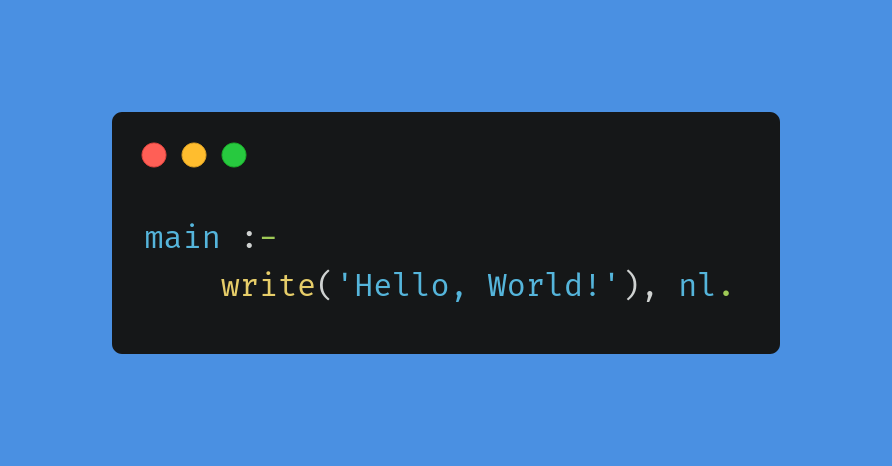

# Hello World

This is a repository to get myself familiarized with git and GitHub. This also contains the "Hello, World!" implementation in all languages I know or currently learning.

## C

## C++

## Bash

## Java

## Python

## JavaScript

## PHP

## Prolog

## TypeScript

## Haskell

